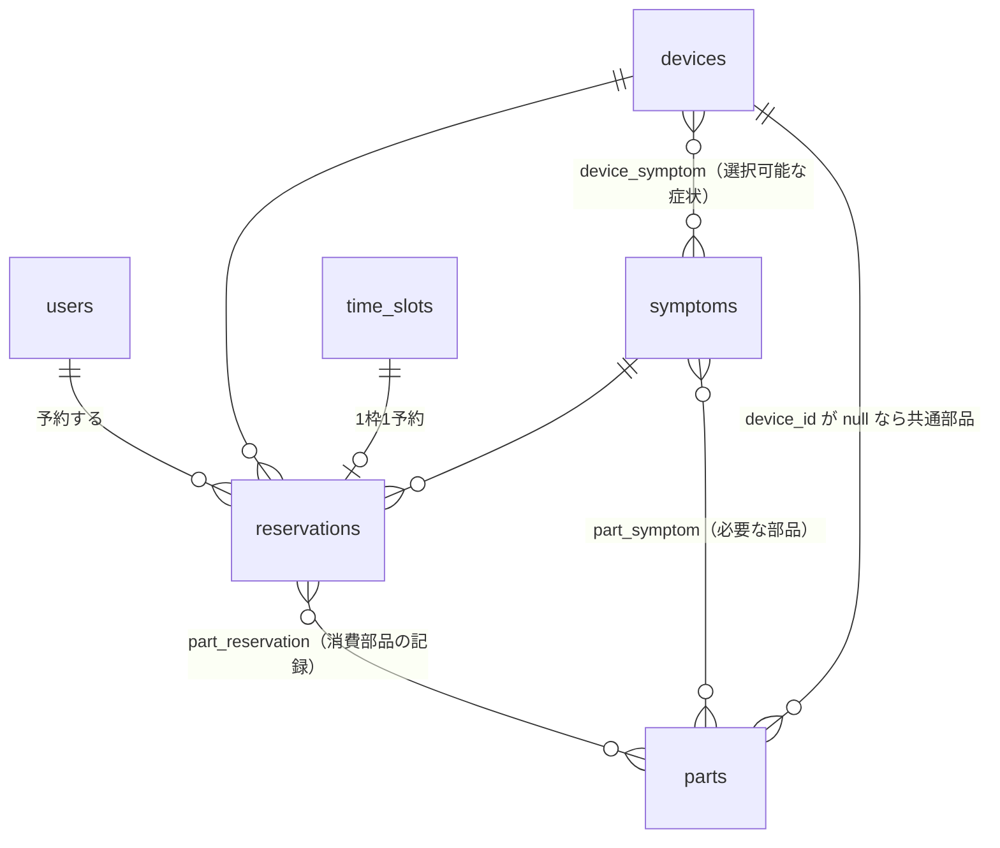
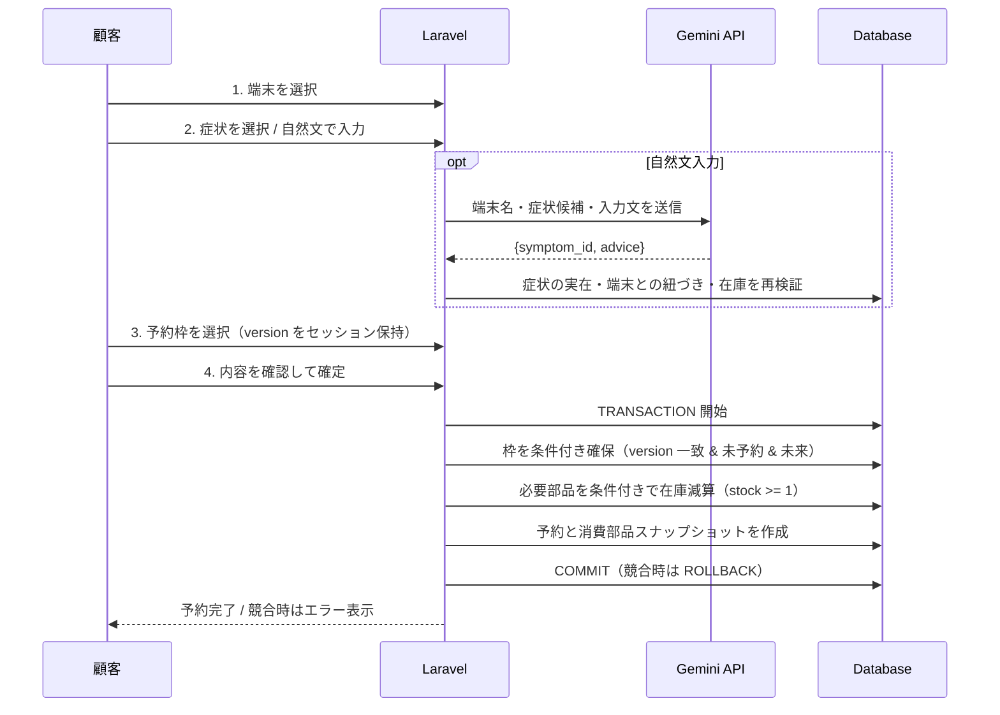

# 楽ペア（Rakupair）— Apple 端末修理の予約管理システム

Apple 端末の修理店を想定した、Web 予約管理システムです。
PHP 研修の自作課題として、要件定義からデータ設計・実装・テストまで個人で担当しました。

顧客は「端末 → 症状 → 日時 → 確認」の 4 ステップで予約を作成でき、
専門用語が分からない場合は**自然文で症状を入力すると Gemini API が既存症状に分類**します。
店舗管理者は予約・予約枠・端末・症状・部品在庫を管理画面から一元管理できます。

- **技術スタック**: PHP 8.2 / Laravel 12 / Blade / SQLite / Vite / PHPUnit 11 / Google Gemini API
- **テスト**: Feature テスト中心に 56 テスト（直近の実行で全件パス）
- **開発体制**: 個人開発（設計・実装・テスト・資料作成）

---

## 目次

- [解決したかった課題](#解決したかった課題)
- [主な機能](#主な機能)
- [技術的な工夫（アピールポイント）](#技術的な工夫アピールポイント)
- [アーキテクチャ](#アーキテクチャ)
- [データモデル](#データモデル)
- [予約フロー](#予約フロー)
- [セットアップ](#セットアップ)
- [デモ用アカウント](#デモ用アカウント)
- [テスト](#テスト)
- [ディレクトリ構成](#ディレクトリ構成)
- [今後の課題・既知の制約](#今後の課題既知の制約)

---

## 解決したかった課題

電話や口頭での修理受付には、次の 4 つの問題があると考えました。

| 課題 | 本システムでの解決 |
|---|---|
| 顧客が故障内容をうまく説明できない | 自然文入力を AI が既存症状へ分類し、簡単な設定案内も提示 |
| 予約を受けた後で必要部品の在庫切れが発覚する | 症状ごとに必要部品を紐づけ、在庫が無い症状は予約不可にする |
| 予約枠の重複・締切済み枠への予約が起きる | 楽観ロック＋トランザクションで枠の二重確保を防止 |
| 端末・症状・部品・予約の情報が分散する | 管理画面 1 画面（5 タブ）に集約し、論理削除と復元にも対応 |

---

## 主な機能

### 顧客（`users.role = 0`）

- 会員登録（入力 → 確認 → 完了の 3 画面）、ログイン / ログアウト
- 4 ステップの予約作成（端末 → 症状 → 日時 → 確認）
- 自然文での症状入力と、AI による症状候補の提示・設定アドバイス
- マイページでの予約一覧・詳細モーダル表示
- 自分の予約のキャンセル（在庫と予約枠を自動で戻す）

### 管理者（`users.role = 1`）

- 全予約の一覧・詳細確認、AI 利用予約の「確認済み」マーク
- 対応不可予約のキャンセル
- 予約枠の追加 / 開閉 / 削除
- 端末・症状・部品の追加 / 編集 / 停止 / 復元、部品在庫の調整

---

## 技術的な工夫（アピールポイント）

### 1. 楽観ロックによる予約枠の二重確保防止

同じ時間枠を 2 人が同時に確定しようとするケースを、`time_slots.version` を使った楽観的排他制御で防いでいます。
顧客が日時を選んだ時点の `version` をセッションに保持し、確定時に条件付き UPDATE を実行します。

```php
$reserved = TimeSlot::where('id', $timeSlot->id)
    ->where('version', $timeSlotVersion)   // 選択時から変化していないこと
    ->where('is_open', true)
    ->where('is_reserved', false)
    ->where('slot_at', '>', now())
    ->update(['is_reserved' => true, 'version' => $timeSlotVersion + 1]);

if ($reserved === 0) {
    throw new ReservationConflictException('time_slot');
}
```

更新行数が 0 件なら他リクエストに先を越されたと判断し、例外を投げてトランザクション全体をロールバックします。
「古いバージョンの枠では予約できないこと」はテストでも担保しています。

### 2. 在庫の条件付き減算と、キャンセル時のロールバック

部品在庫も同様に `WHERE stock >= 1` の条件付き `decrement` で減算し、0 件更新なら在庫切れとして例外を投げます。
予約成立時は `part_reservation` に「実際に消費した部品のスナップショット」を書き込み、
キャンセル時はそのスナップショットに基づいて在庫を戻します。

二重キャンセルによる在庫の二重復元を防ぐため、**ステータス更新が実際に成功した 1 回目のみ**在庫を戻す実装にしており、これもテストで検証しています。

### 3. AI 出力を信用しないサーバサイド再検証

Gemini が返した `symptom_id` はそのまま採用せず、アプリ側で再度チェックします。

- その症状が実在するか（論理削除されていないか）
- 選択中の端末に紐づく症状か
- 必要部品の在庫が残っているか

API キー未設定・通信エラー・不正な JSON の場合は空の結果を返し、**顧客は症状一覧からの手動選択に必ずフォールバックできる**設計です。
AI を予約成立の必須依存にはしていません。

### 4. トランザクション境界の明確化

予約作成では「予約枠の確保 → 各部品の在庫減算 → 予約レコード作成 → 消費部品スナップショット作成」を単一の `DB::transaction` で実行します。
枠の競合・在庫切れのいずれが発生しても全体をロールバックし、中途半端な予約が残らないようにしています。

### 5. 論理削除と履歴表示の両立

端末・症状・部品・予約枠は `SoftDeletes` を採用しています。
顧客側の一覧では削除済みを除外しつつ、過去の予約詳細では `withTrashed()` で症状名・部品名を表示し続けます。
また `pending` / `no_show` の予約から参照されているマスタは停止できないよう制限しています。

### 6. ロール分離とテスト

`EnsureCustomer` / `EnsureAdmin` ミドルウェアで顧客・管理者の導線を分離し、
キャンセル処理では `user_id` を再度条件に含めて他人の予約を操作できないようにしています。
これらの権限境界・業務ルールは Feature テストで検証しています。

---

## アーキテクチャ

サーバサイドレンダリングの標準的な Laravel MVC 構成です（SPA / JSON API 層は持ちません）。

```text
Browser
  └─ routes/web.php
       └─ customer / admin ミドルウェア
            └─ Controllers
                 ├─ Eloquent Models ──── Database (SQLite)
                 ├─ SymptomAiService ─── Gemini REST API
                 └─ Blade Views
```

| 層 | 実装 |
|---|---|
| バックエンド | PHP 8.2 / Laravel 12 |
| ORM | Eloquent |
| テンプレート | Blade |
| スタイル | 自作 CSS（Vite / Tailwind CSS 4 プラグインも導入済み） |
| フロントビルド | Vite 7 + Laravel Vite Plugin 2 |
| DB | SQLite（マイグレーションで DB 抽象を維持） |
| セッション / キャッシュ / キュー | database ドライバ |
| 外部 AI | Google Gemini REST API（既定モデル `gemini-2.5-flash`） |
| テスト | PHPUnit 11 |
| タイムゾーン | `Asia/Tokyo` |

---

## データモデル



主なテーブル:

| テーブル | 役割 | 特徴的なカラム |
|---|---|---|
| `users` | 顧客・管理者 | `role`（0=顧客 / 1=管理者）、住所・電話番号 |
| `devices` | 対応端末 | 論理削除対応 |
| `symptoms` | 症状マスタ | 「来店相談」は部品不要の特別枠 |
| `parts` | 部品と在庫 | `device_id`（null = 共通部品）、`stock` |
| `time_slots` | 予約枠（1 枠 1 予約） | `slot_at`（一意）、`is_open`、`is_reserved`、`version` |
| `reservations` | 予約 | `status`、`symptom_text`（AI 入力の原文）、`ai_reviewed_at` |

予約ステータス:

| ステータス | 意味 |
|---|---|
| `pending` | 予約中（予約時刻前） |
| `no_show` | 予約時刻を過ぎたが未処理 |
| `cancelled_by_user` | 顧客によるキャンセル |
| `cancelled_by_admin` | 管理者によるキャンセル |

必要部品の判定は「その症状に紐づく部品のうち、共通部品（`device_id IS NULL`）または選択端末専用の部品」で、
**該当する部品はすべて 1 個ずつ必要**という扱いです。

---

## 予約フロー



---

## セットアップ

**前提**: PHP 8.2 以上 / Composer / Node.js

```bash
git clone git@github.com:Kozu0822/php-selfmade.git
cd php-selfmade
composer install
cp .env.example .env
php artisan key:generate
touch database/database.sqlite
php artisan migrate --seed
npm install
npm run build
php artisan serve
```

`http://localhost:8000` にアクセスしてください。

### AI 機能を使う場合

`.env` に Gemini の API キーを設定します。

```dotenv
GEMINI_API_KEY=your-api-key
GEMINI_MODEL=gemini-2.5-flash
```

未設定でも動作します。その場合は AI 診断が利用不可である旨を画面に表示し、症状は一覧から手動選択します。

### 開発モード

```bash
composer run dev
```

PHP サーバ・キューリスナ・ログ（Pail）・Vite を同時に起動します。

---

## デモ用アカウント

`DatabaseSeeder` が作成するローカル検証用アカウントです（本番利用は想定していません）。

| 種別 | メールアドレス | パスワード |
|---|---|---|
| 顧客 | `customer@example.com` | `password` |
| 管理者 | `admin@example.com` | `password` |

シーダーは端末 5 種（iPhone 15 Pro / iPhone 13 / iPhone 17 / iPad Air 5th / MacBook Air）、
画面割れ・バッテリー劣化などの症状、専用／共通部品、20 分刻みの予約枠、サンプル予約を投入します。

---

## テスト

```bash
php artisan test
```

Feature テスト中心に **56 テスト**（直近の実行で全件パス）。主な検証内容は次のとおりです。

- 登録バリデーション、メール重複、ロール別のログイン後リダイレクト
- 端末・症状・部品の追加 / 編集 / 停止 / 復元ルール
- 予約枠の営業時間・期限切れ・開閉・削除制限
- 予約作成、複数必要部品の在庫減算、キャンセル時の在庫復元
- **二重キャンセルで在庫が二重に戻らないこと**
- **古い `version` の予約枠では予約が作成できないこと**
- 在庫切れ／必要部品未設定の症状が予約できないこと
- 日本時間基準での過去枠判定
- AI による症状選択、在庫切れ時の拒否、設定アドバイスの提示

---

## ディレクトリ構成

```text
app/
  Exceptions/ReservationConflictException.php   予約枠・在庫の競合例外
  Http/
    Controllers/
      Admin/DashboardController.php             管理画面（5タブ）と全管理操作
      Auth/                                     登録・ログイン
      MypageController.php                      顧客の予約一覧・詳細
      ReservationController.php                 予約ウィザード / AI / 予約トランザクション
    Middleware/                                 EnsureAdmin, EnsureCustomer
  Models/                                       Device, Part, Reservation, Symptom, TimeSlot, User
  Services/SymptomAiService.php                 Gemini 連携（プロンプト構築・JSON 検証）
database/
  migrations/                                   スキーマ定義と後続の変更
  seeders/DatabaseSeeder.php                    デモデータ
resources/views/                                Blade（top / auth / mypage / reservations / admin）
routes/web.php                                  全 Web ルート
tests/Feature/                                  振る舞いテスト
docs/                                           企画・要件・DB 設計・発表資料
```

---

## 今後の課題・既知の制約

作りながら見えてきた、実務であれば次に着手したい点です。

- `ReservationController` と `DashboardController` に、期限切れ枠・未到店・リソース解放の重複ロジックがある → サービス層への抽出
- `no_show` への遷移が画面アクセス契機のため、スケジューラ／キューへ移行したい
- 予約ステータスが文字列のため、PHP Enum または DB 制約で型を固めたい
- 予約枠が「1 枠 1 予約」固定で、枠あたりの受入人数（capacity）を持たない
- 部品要件が「各 1 個」のみで、数量・代替部品・いずれか 1 つといった表現ができない
- 管理 UI から共通部品（`device_id = null`）を新規作成できない
- AI レスポンスの検証が基本的な JSON チェックのみで、JSON Schema レベルの検証や診断ログがない
- 決済・見積・通知（メール／SMS）、修理進捗ステータス、多店舗対応は範囲外
- E2E（ブラウザ）テストと本番デプロイ手順は未整備

---

## ライセンス

学習目的の個人開発プロジェクトです。
